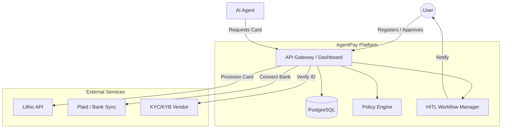
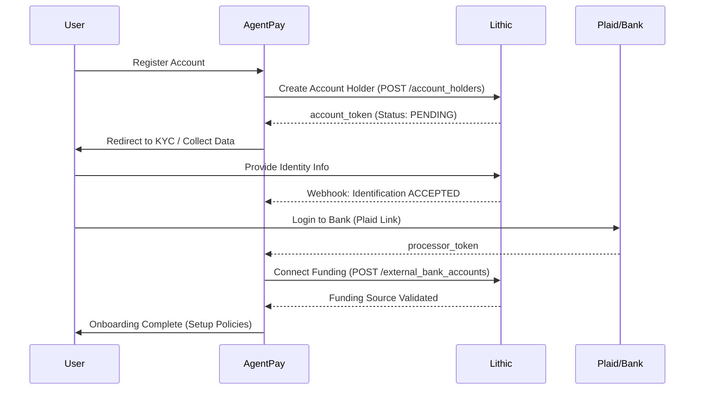
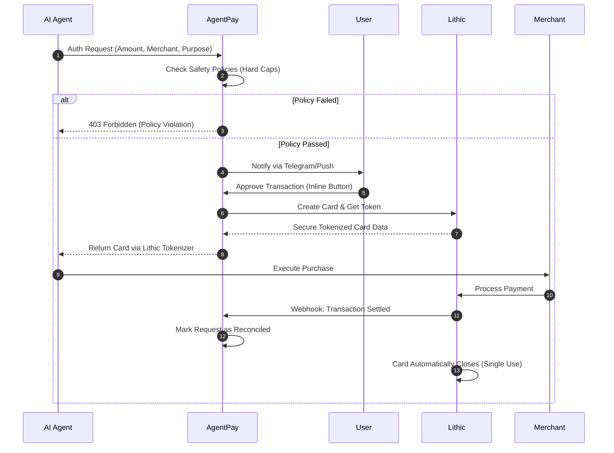

# AgentPay System Diagrams

This document visualizes the core flows and architecture of the AgentPay system.

## 1. System Architecture
This diagram showing the high-level orchestration between the User, Agent, AgentPay (Backend), and Lithic.

---

## 2. New User Onboarding Flow
This sequence covers registration, KYC, and bank connection via Lithic/Plaid.

---

## 3. Purchase Authorization Flow (HITL)
The core loop where an agent requesting a card leads to a human-in-the-loop approval and ephemeral card issuance.

