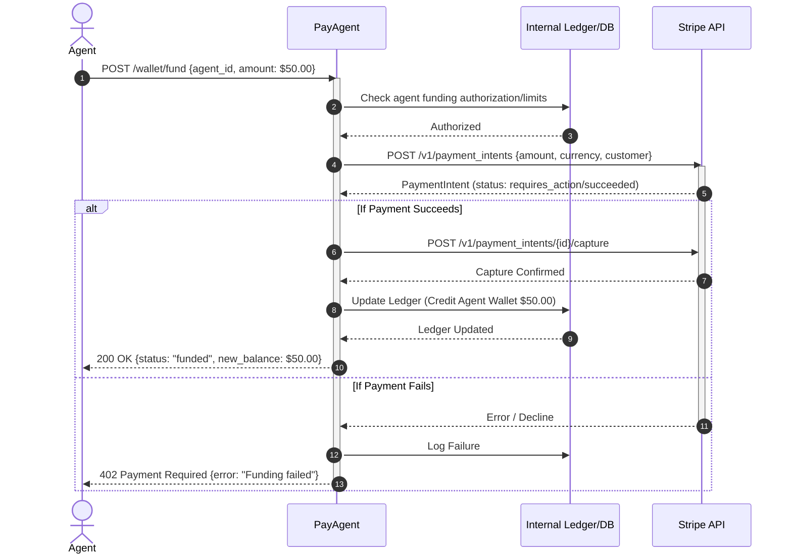

```mermaid
sequenceDiagram
    autonumber
    actor Agent
    participant Middleware as PayAgent
    participant Database as Internal Ledger/DB
    participant Stripe as Stripe API

    Agent->>Middleware: POST /wallet/fund {agent_id, amount: $50.00}
    activate Middleware
    Middleware->>Database: Check agent funding authorization/limits
    Database-->>Middleware: Authorized
    
    Middleware->>Stripe: POST /v1/payment_intents {amount, currency, customer}
    activate Stripe
    Stripe-->>Middleware: PaymentIntent (status: requires_action/succeeded)
    
    alt If Payment Succeeds
        Middleware->>Stripe: POST /v1/payment_intents/{id}/capture
        Stripe-->>Middleware: Capture Confirmed
        Middleware->>Database: Update Ledger (Credit Agent Wallet $50.00)
        Database-->>Middleware: Ledger Updated
        Middleware-->>Agent: 200 OK {status: "funded", new_balance: $50.00}
    else If Payment Fails
        Stripe-->>Middleware: Error / Decline
        deactivate Stripe
        Middleware->>Database: Log Failure
        Middleware-->>Agent: 402 Payment Required {error: "Funding failed"}
    end
    deactivate Middleware
```

