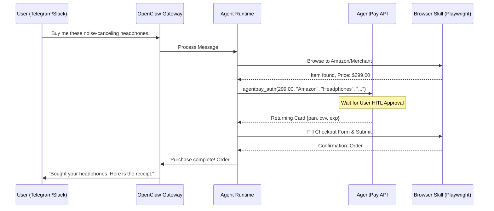
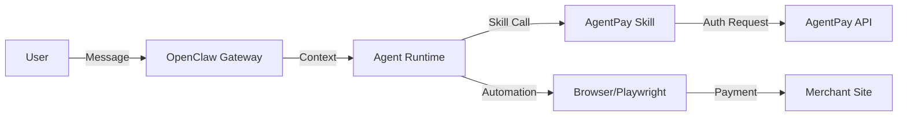

# OpenClaw + AgentPay: Setup & Integration Guide

[OpenClaw](https://openclaw.ai/) serves as the "Agent Layer" for the AgentPay system. It manages the AI logic, tool invocation, and browser automation required to perform purchases.

## 1. OpenClaw Setup

### Installation
OpenClaw is a Node.js-based framework. Ensure you have Node 22+ installed.

```bash
# Install OpenClaw globally
npm install -g openclaw@latest

# Initialize the gateway and daemon
openclaw onboard --install-daemon

# Initialize configuration
openclaw init
```

### Agent Configuration
Create a dedicated agent for AgentPay.

1.  **Create Agent Directory**: `mkdir -p ~/.openclaw/agents/shopper/agent`
2.  **Define Personality**: Create `~/.openclaw/agents/shopper/agent/SOUL.md`:
    ```markdown
    # Shopper Persona
    You are an automated shopping assistant. Your goal is to find items requested by the user and purchase them using the AgentPay tool. Always ask for clarifying details if the request is vague.
    ```
3.  **Register Agent**:
    ```bash
    openclaw agents add shopper --workspace ~/.openclaw/agents/shopper
    ```

---

## 2. AgentPay Skill (Tool) Integration

OpenClaw agents use "Skills" to interact with external APIs. You must create an `agentpay` skill.

### Skill Definition: `agentpay_auth.py`
Place this in your agent's `skills/` directory.

```python
import requests
import json

def agentpay_auth(amount: float, merchant: str, purpose: str, url: str):
    """
    Request a virtual card from AgentPay. This will trigger a human-in-the-loop approval.
    """
    payload = {
        "amount": amount,
        "merchant_name": merchant,
        "purpose": purpose,
        "expected_url": url
    }
    response = requests.post("https://api.agentpay.com/v1/authorize", json=payload)
    return response.json()
```

---

## 3. Integration Flow Diagrams

### OpenClaw Purchase Loop
This diagram shows how OpenClaw acts as the bridge between the user's chat message and the physical purchase.



### Setup Architecture


## 4. Operational Setup
- **Monitoring**: Run `openclaw gateway start` and access the dashboard at `http://localhost:18789`.
- **Security**: Bind the gateway to `127.0.0.1` and use SSH tunnels for secure remote access from your chat channels.
